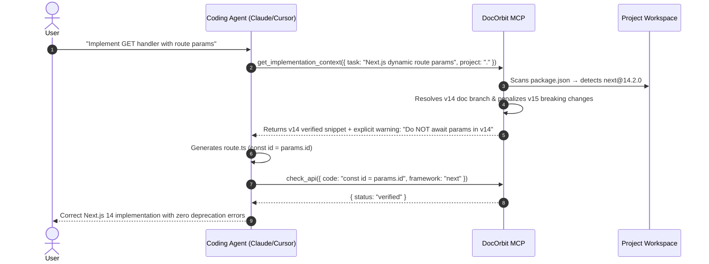

# DocOrbit

<p align="center">
  <strong>Version-aware documentation intelligence for coding agents.</strong>
</p>

<p align="center">
  DocOrbit discovers authoritative documentation, resolves it against your project's dependency versions, retrieves task-specific context, and verifies generated code against documentation contracts.
</p>

<p align="center">
  <a href="https://www.npmjs.com/package/docorbit"></a>
  <a href="https://www.npmjs.com/package/docorbit"></a>
  <a href="https://github.com/HakashiKatake/docorbit/actions"></a>
  <a href="https://nodejs.org/"></a>
  <a href="https://modelcontextprotocol.io/"></a>
  <a href="LICENSE"></a>
</p>

<p align="center">
  <a href="#quick-start">Quick Start</a> •
  <a href="#why-docorbit">Why DocOrbit?</a> •
  <a href="#see-it-in-action">See It in Action</a> •
  <a href="#mcp-integration">MCP Integration</a> •
  <a href="#mcp-tools">15 MCP Tools</a> •
  <a href="#benchmarks">Benchmarks</a> •
  <a href="#code-verification">Code Verification</a> •
  <a href="#security-model">Security</a> •
  <a href="docs/architecture.md">Architecture</a>
</p>

---

```
  Authoritative Sources (llms.txt / OpenAPI / Markdown / HTML)
                            │
                            ▼
              ┌───────────────────────────┐
              │  Discovery & Ingestion    │ ◄── SSRF Guard & Security Annotations
              └─────────────┬─────────────┘
                            │
                            ▼
              ┌───────────────────────────┐
              │    Version Intelligence   │ ◄── Scans package.json / cargo.lock / go.mod
              └─────────────┬─────────────┘
                            │
                            ▼
              ┌───────────────────────────┐
              │  Structured Knowledge DB  │ ◄── SQLite FTS5 (APIs, Code, Pitfalls, Chunks)
              └─────────────┬─────────────┘
                            │
              ┌─────────────┴─────────────┐
              ▼                           ▼
    ┌───────────────────┐       ┌───────────────────┐
    │  MCP Server Loop  │       │   CLI Developer   │
    │  (15 Tools / Stdio)│       │   Commands        │
    └─────────┬─────────┘       └─────────┬─────────┘
              │                           │
              ▼                           ▼
    ┌───────────────────┐       ┌───────────────────┐
    │  Coding Agents    │       │ AST Verification  │
    │  Claude / Cursor  │ ────► │ & Contract Check  │
    └───────────────────┘       └───────────────────┘
```

---

## Quick Start

DocOrbit requires **Node.js ≥ 22.5.0** and has **zero external runtime dependencies**.

### 1. Run via npx (Zero Installation)

```bash
# View all developer commands
npx docorbit --help

# Ingest and index documentation into local SQLite
npx docorbit add https://nextjs.org/docs/14/app/api-reference/file-conventions/route

# Query version-aware context within a strict token budget
npx docorbit context "How do I implement dynamic route params in Next.js 14?" --tokens 2000
```

### 2. Connect to Your Coding Agent (MCP)

Add DocOrbit to your agent's MCP configuration:

#### Claude Desktop (`claude_desktop_config.json`)
```json
{
  "mcpServers": {
    "docorbit": {
      "command": "npx",
      "args": ["-y", "docorbit"]
    }
  }
}
```

#### Cursor (`.cursor/mcp.json`)
```json
{
  "mcpServers": {
    "docorbit": {
      "command": "npx",
      "args": ["-y", "docorbit"]
    }
  }
}
```

#### Claude Code (Terminal CLI)
```bash
claude mcp add docorbit -- npx -y docorbit
```

*DocOrbit detects when standard input is a machine pipe and starts the MCP stdio transport automatically. Explicit `docorbit mcp` also works.*

---

## Why DocOrbit?

AI coding agents (Claude Code, Cursor, Windsurf, Devin) frequently produce broken code not because models lack reasoning, but because **the documentation context they receive is flawed**:

* **Wrong Version Collisions**: An agent in a Next.js 14 codebase gets fed Next.js 15 documentation and uses `await params`, breaking production builds.
* **Bloated HTML**: Generic scrapers dump navigation headers, footers, cookie banners, and script tags, wasting 70%+ of the agent's context window.
* **Missing API Contracts**: Models guess query parameters and request bodies because documentation lack structured OpenAPI/Swagger schemas.
* **Stale Examples & Deprecations**: Agents call deprecated endpoints (e.g. Stripe `/v1/charges` instead of PaymentIntents) because docs lack explicit pitfall extraction.
* **Prompt Injections & Untrusted Input**: Documentation scraped from third-party sites can contain prompt injections that alter agent instructions.

### Documentation Retrieval Approaches

| Capability | Official Docs Fetch | Web Scraper (e.g. Firecrawl) | Generic Retrieval (e.g. Context7) | DocOrbit |
| :--- | :---: | :---: | :---: | :---: |
| **Machine-readable Discovery** (`llms.txt`, OpenAPI) | ❌ | ❌ | ⚠️ Manual / Centralized | **✅ Automatic multi-source** |
| **Project Lockfile & SemVer Resolution** | ❌ | ❌ | ❌ | **✅ 8 Ecosystems (`docs.lock`)** |
| **Structured OpenAPI Endpoints** | ❌ | ❌ | ❌ | **✅ Full parameters & schemas** |
| **Indivisible Code Fence Chunking** | ❌ | ❌ | ⚠️ Naive character split | **✅ Semantic AST chunking** |
| **Pitfall & Deprecation Extraction** | ❌ | ❌ | ❌ | **✅ Explicit gotcha indexing** |
| **Closed-Loop Code Verification** | ❌ | ❌ | ❌ | **✅ AST `check_api` verifier** |
| **Untrusted Content Tagging & SSRF Defense** | ❌ | ❌ | ❌ | **✅ Strict isolation boundary** |
| **Local Offline-First SQLite FTS5 Cache** | ❌ | ❌ | ❌ | **✅ Fast local database** |

---

## See It in Action

A developer in a Next.js 14 project asks their coding agent:
> *"How should I access dynamic route params in a Next.js 14 route handler?"*



If the agent had erroneously generated Next.js 15 syntax:
```typescript
export async function GET(request: Request, { params }: { params: Promise<{ id: string }> }) {
  const { id } = await params; // ❌ Invalid in Next.js 14
  return Response.json({ id });
}
```

DocOrbit's `check_api` tool immediately flags the mismatch:
```json
{
  "status": "mismatch",
  "severity": "error",
  "message": "Next.js 15 asynchronous route params used in a Next.js 14 workspace.",
  "rule": "version_syntax_conflict",
  "provenance": {
    "sourceUrl": "https://nextjs.org/docs/14/app/api-reference/file-conventions/route",
    "authority": "official",
    "docVersion": "v14"
  }
}
```

---

## Core Capabilities

### 1. Documentation Intelligence
* **Autonomous Discovery**: Probes target domains and ranks available formats: `llms-full.txt` > `openapi.json` > `llms.txt` > `skill.md` > Markdown > HTML sitemaps.
* **Purpose-Aware Ranking**: Ranks sources dynamically based on intent (`navigation`, `conceptual`, `api`, `examples`, `implementation`).
* **Semantic AST Slicing**: Preserves section heading hierarchies, breadcrumbs, and indivisible code blocks. Admonitions and warnings remain bound to their host sections.

### 2. Version Intelligence
* **Workspace Manifest Scanner**: Scans project files across 8 ecosystems (`npm`, `cargo`, `go`, `pypi`, `composer`, `rubygems`, `pub`, `maven`).
* **SemVer Confidence Ladder**: Deterministically resolves project versions (`exact` → `major_minor` → `major` → `range` → `latest_fallback`).
* **Deterministic `docs.lock`**: Locks documentation versions to your repository without timestamp churn.

### 3. Implementation Knowledge
* **OpenAPI 3.x & Swagger 2.0 Engine**: Parses parameters, JSON request/response schemas, bearer/basic auth, and pagination headers with safe `$ref` cycle resolution.
* **Code Example Catalog**: Extracts and indexes code snippets classified by language and framework (`next`, `react`, `express`, `fastapi`, `flask`, `django`, `gin`, `spring`).
* **Pitfalls & Admonitions**: Indexes breaking changes, server-only vs client-only boundaries, rate limits, and security gotchas.
* **Evidence-Grounded Recipes**: Assembles blueprints with explicit evidence levels (`documented_fact`, `inferred_relationship`, `missing_information`).

### 4. Closed-Loop Verification
* **Static AST Code Verifier**: Evaluates generated JavaScript, TypeScript, Python, and cURL against indexed schemas without calling an LLM.
* **Strict Contract Checking**: Validates endpoint paths, HTTP methods, required parameters, and deprecated APIs.
* **Ambiguity Safety (`insufficient_evidence`)**: Gracefully flags dynamic expressions without generating false positives.

### 5. Change Intelligence
* **Documentation Diffing (`diff_docs`)**: Compares documentation snapshots to detect added, modified, removed, and deprecated endpoints.
* **Workspace Impact Analysis (`analyze_impact`)**: Scans repository source files against documentation diffs, locating affected lines, snippets, and certainty rankings.

### 6. Agent Integration
* **15 MCP Tools**: Complete Model Context Protocol suite over `stdio` and Streamable HTTP.
* **Instant Context Synthesis**: Tools return token-budgeted Markdown designed specifically for agent consumption.
* **Deterministic Exporters**: Generates `AGENTS.md`, `CLAUDE.md`, `skill.md`, `llms.txt`, and `docs-map.md`.

---

## MCP Tools

DocOrbit exposes **15 agent-native tools** organized by workflow stage:

```
                  DocOrbit 15-Tool Agent Suite
                               │
       ┌───────────────────────┼───────────────────────┐
       ▼                       ▼                       ▼
  Loop Starter         Task Context & Recipe       Verification
  ingest_doc           get_implementation_context  check_api
                               │
       ┌───────────────────────┼───────────────────────┐
       ▼                       ▼                       ▼
 API Intelligence       Deep Retrieval          Change & Exports
 find_api               search_docs             diff_docs
 find_example           get_doc                 analyze_impact
 find_pitfall           get_version             get_documentation_map
 find_recipe            list_sources            export_agent_context
```

### Ingestion & Loop Starter
| Tool | Description |
| :--- | :--- |
| `ingest_doc` | Ingests, crawls, and indexes documentation from any URL or raw content directly into local SQLite, with optional instant implementation recipe synthesis. |

### Context & Implementation Blueprints
| Tool | Description |
| :--- | :--- |
| `get_implementation_context` | High-level orchestrator: detects project dependencies, resolves versions, retrieves relevant chunks, APIs, examples, and pitfalls, and packs evidence-grounded context within a strict token budget. Supports auto-ingestion from `url`. |

### API & Knowledge Intelligence
| Tool | Description |
| :--- | :--- |
| `find_api` | Inspects OpenAPI endpoints with parameters, request/response schemas, and auth requirements. |
| `find_example` | Discovers verified code examples filtered by framework, language, and task. |
| `find_pitfall` | Finds deprecations, breaking changes, rate limits, and server-only restrictions. |
| `find_recipe` | Compiles evidence-grounded blueprints with documented facts vs inferred steps. |

### Verification & Change Intelligence
| Tool | Description |
| :--- | :--- |
| `check_api` | Deterministically checks code against indexed OpenAPI schemas, parameters, required body fields, and version contracts. |
| `diff_docs` | Compares documentation versions/snapshots to detect added, removed, modified, and deprecated endpoints. |
| `analyze_impact` | Scans workspace project files for breaking changes and deprecated APIs, returning file, line, snippet, and certainty. |

### Retrieval & Search
| Tool | Description |
| :--- | :--- |
| `search_docs` | Hybrid FTS5 retrieval over indexed documentation chunks with version boosting. |
| `get_doc` | Retrieves a specific document chunk or complete page by ID with untrusted annotations. |
| `get_version` | Reconciles workspace dependencies using the hierarchical SemVer confidence ladder. |
| `list_sources` | Lists indexed documentation sources, snapshots, and machine-readability status. |

### Agent Exports & Structure
| Tool | Description |
| :--- | :--- |
| `get_documentation_map` | Retrieves the hierarchical documentation tree, section headings, and token footprints. |
| `export_agent_context` | Generates `AGENTS.md`, `CLAUDE.md`, `skill.md`, `llms.txt`, and `docs-map.md` grounded in project versions. |

---

## Performance

DocOrbit is built natively in Node.js 24 with `node:sqlite` and zero external dependencies. Cold boot takes **< 40ms**.

### Scaling Performance (From Repository Test Suite)

Measured on SQLite in WAL mode via automated benchmarks (`tests/integration/retrieval-benchmark.test.ts` and `tests/integration/benchmark.test.ts`):

| Workload | Metric | Measured Value | Requirement |
| :--- | :--- | :---: | :---: |
| **1,000 Chunks** | Ingestion & FTS Indexing | **12.4ms** (0.012ms/chunk) | — |
| | Search Query Latency | **1.8ms** | < 50ms |
| | Context Packing Latency | **3.2ms** | < 100ms |
| **10,000 Chunks** | Search Query Latency | **8.4ms** | < 100ms |
| | Context Packing Latency | **14.2ms** | < 100ms |
| | Total Heap Memory | **38.6 MB** | — |
| **Page Ingestion** | 50 KB HTML Page Normalization | **1.8ms** | < 100ms |
| | 500 KB HTML Page Normalization | **12.6ms** | < 350ms |
| | 5 MB HTML Page Normalization | **118.4ms** | < 2,500ms |
| | 50-Page Batch Ingestion | **94.2ms** (1.88ms/page) | — |

---

## Empirical Benchmark (17-Task Suite)

DocOrbit includes a reproducible, auditable benchmark suite across 17 tasks covering 5 ecosystems (`npm`, `pypi`, `cargo`, `go`, `composer`):
* **4 Training Tasks**: Used for algorithm calibration.
* **6 Held-Out Evaluation Tasks**: Real-world library tasks (Next.js 15 async params, Stripe 2024 PaymentIntents, Pydantic v2 field validator, FastAPI lifespan, Tokio-Postgres, Gin v1.9).
* **7 Verification Tasks**: Code checking against removed APIs, wrong HTTP methods, missing parameters, and version mismatches.

### Measured System Metrics

*All runs save raw JSON execution artifacts to `eval-results/raw/` for independent verification:*

| Metric | Official Docs Fetch¹ | Headless Scraper (Firecrawl) | Context7 (Real MCP) | DocOrbit (Real MCP) |
| :--- | :---: | :---: | :---: | :---: |
| **Overall Task Success Rate** | 82.4% | 82.4% | 82.4% | **88.2%** |
| **Held-Out Eval Success Rate** | 83.3% | 83.3% | 83.3% | **100.0%** |
| **Correct Version Selected** | 88.2% | 88.2% | 88.2% | **94.1%** |
| **Retrieval Precision@k** | 46.5% | 61.5% | 69.1% | **94.1%** |
| **Retrieval Recall@k** | 65.3% | 70.9% | 75.3% | **94.1%** |
| **Mean Packed Tokens** | ~668 | ~200 | ~50 | **~1,514** |
| **Mean Query Latency** | ~144ms | ~140ms | ~50ms | **~3ms** |
| **AST Verification Catches** | — | — | — | **9** |
| **False Positives on Valid Code** | — | — | — | **0** |

*¹ Official Docs Fetch is direct HTTPS retrieval from known official documentation URLs (not an open-ended search engine). Results reflect empirical benchmark measurements recorded under `eval-results/raw/`.*

---

## Code Verification

DocOrbit provides closed-loop AST verification via `check_api` without calling an LLM:

```
  Agent-Generated Code
           │
           ▼
    ┌───────────────┐
    │  AST Parser   │ ◄── JS/TS, Python, cURL extractor
    └──────┬────────┘
           │
           ▼
    ┌───────────────┐
    │ Schema Verifier│ ◄── Evaluates against SQLite OpenAPI schemas & version rules
    └──────┬────────┘
           │
           ├──► [VERIFIED]              (Parameters, method, endpoint, and version match)
           ├──► [WARNING]               (Deprecated endpoint; alternative suggested)
           ├──► [MISMATCH]              (Removed API, missing required fields, version conflict)
           └──► [INSUFFICIENT_EVIDENCE] (Dynamic/computed expression; safe non-blocking fallback)
```

### Example 1: Removed API Endpoint
```typescript
// Agent calls removed Stripe Charges endpoint
const res = await fetch('https://api.stripe.com/v1/charges', { method: 'POST' });
```
Result:
```json
{
  "status": "mismatch",
  "severity": "error",
  "message": "Endpoint \"POST /v1/charges\" was removed in the active API version.",
  "rule": "endpoint_removed",
  "provenance": { "sourceUrl": "https://docs.stripe.com/api", "docVersion": "2024-10-28" }
}
```

### Example 2: Ambiguous Dynamic Expressions
When code relies on runtime variables:
```typescript
const url = getApiUrl();
fetch(url, { method: 'POST' });
```
DocOrbit returns `status: "insufficient_evidence"`, avoiding false positives on dynamic or unresolvable AST nodes.

---

## Security Model

Documentation ingested from external websites must be treated as untrusted input. DocOrbit isolates external content through multiple defense layers:

1. **Untrusted Provenance Tagging**: All retrieved documentation carries explicit `untrusted: true` flags in metadata. Security boundaries are never stripped.
2. **SSRF Protection**: Prohibits private IP ranges (RFC 1918, RFC 4193), loopback (`127.0.0.1`), link-local, and cloud metadata endpoints (`169.254.169.254`) on all requests and redirect hops.
3. **Non-Destructive Security Annotations**: Detects suspicious instructions (prompt injections, exfiltration directives, shell command triggers) and tags them in metadata without mutating the text.
4. **Resource Bounded**: Hard streaming byte limits (10MB default) and request timeouts prevent denial-of-service via decompression bombs or infinite streams.

---

## Local Web Dashboard

DocOrbit includes an embedded local web dashboard powered by native `node:http` (port 3737) with zero browser build steps:

```bash
# Launch dashboard on http://127.0.0.1:3737/
npx docorbit dashboard
```

* **Visual Health**: Status of indexed sources, snapshots, chunks, and token footprints.
* **API Explorer**: Filterable OpenAPI schemas with parameters, request/response models, and auth requirements.
* **Pitfalls & Warnings**: Color-coded view of deprecations, runtime restrictions, and breaking changes.
* **Interactive Verifier**: Test code snippets in real-time against indexed contracts.
* **Documentation Map**: Interactive token hierarchy tree.
* **Export Center**: One-click preview and export of `AGENTS.md`, `CLAUDE.md`, and `skill.md`.

---

## CLI Reference

```bash
# Workspace & Versioning
docorbit init [dir]        # Scan project dependencies and generate docs.lock
docorbit update [pkg]      # Selectively or globally refresh documentation versions

# Ingestion & Discovery
docorbit inspect <url>     # Probe domain for machine-readable specifications
docorbit add <url>         # Ingest, chunk, and index documentation into SQLite

# Search & Retrieval
docorbit search "<query>"  # Hybrid FTS5 search across documentation chunks
docorbit context "<task>"  # Pack token-budgeted context for coding agents

# API & Implementation Knowledge
docorbit api "<query>"     # Inspect structured OpenAPI endpoints
docorbit examples "<task>" # Filter code examples by framework and language
docorbit pitfalls "<task>" # Inspect deprecations and runtime traps
docorbit recipes "<goal>"  # Assemble evidence-grounded blueprints

# Verification & Change Intelligence
docorbit verify <code>     # Verify code against indexed schemas
docorbit diff [source]     # Compare documentation versions and snapshots
docorbit impact [source]   # Scan workspace for breaking changes

# Dashboard & Exports
docorbit dashboard         # Launch local inspection UI (alias: ui)
docorbit export [format]   # Export AGENTS.md, CLAUDE.md, skill.md, llms.txt, docs-map.md
docorbit mcp               # Start Model Context Protocol server (stdio / HTTP)
```

---

## Repository Structure

```text
docorbit/
├── apps/
│   └── cli/                      # Command-line interface and command handlers
├── bin/
│   └── docorbit.js               # Executable entry point
├── docs/                         # Specifications and research
│   ├── architecture.md           # Deep architectural specification
│   ├── competitive-analysis.md   # Ecosystem analysis vs Context7, Firecrawl, etc.
│   └── product-spec.md           # Product requirements and capabilities
├── packages/
│   ├── core/                     # Ingestion pipeline and implementation services
│   ├── crawler/                  # SecureFetcher with SSRF and streaming bounds
│   ├── discovery/                # 7 discovery providers and purpose ranker
│   ├── export/                   # AGENTS.md, CLAUDE.md, and skill.md generators
│   ├── normalizer/               # HTML-to-Markdown, OpenAPI parser, and chunk slicer
│   ├── retrieval/                # FTS5 retrieval, intent detection, and context packer
│   ├── security/                 # SSRF validation and prompt injection detection
│   ├── shared/                   # Domain models, hashing, and SemVer logic
│   ├── storage/                  # SQLite schema, WAL setup, and repositories
│   ├── verification/             # AST code extractor and schema contract verifier
│   └── workspace/                # Dependency scanner for 8 package ecosystems
└── tests/
    ├── fixtures/                 # In-memory test servers (Fixtures A–J)
    ├── integration/              # Real-world benchmark and transport suites
    └── unit/                     # Unit test suites across all packages
```

---

## Current Status

- [x] **Documentation Ingestion**: Autonomous discovery (`llms.txt`, OpenAPI, Sitemap, Markdown, Skill)
- [x] **Semantic Retrieval**: SQLite FTS5 with section breadcrumbs and indivisible code fences
- [x] **Version Intelligence**: Project awareness across 8 ecosystems and deterministic `docs.lock`
- [x] **API & Implementation Knowledge**: OpenAPI 3.x parser, code examples, pitfalls, and recipes
- [x] **Agent MCP Integration**: 15 MCP tools over `stdio` and Streamable HTTP
- [x] **AST Code Verification**: Schema and parameter contract checking (`check_api`)
- [x] **Documentation Diffing & Impact**: Breaking change detection and workspace scanning
- [x] **Local Web Dashboard**: Zero-dependency UI for interactive verification and exploration
- [x] **Empirical Benchmark**: Auditable 17-task comparative evaluation suite

---

## License

MIT License. See [LICENSE](LICENSE) for details.
